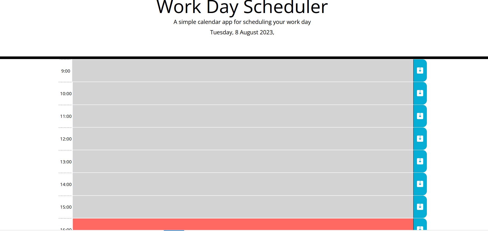
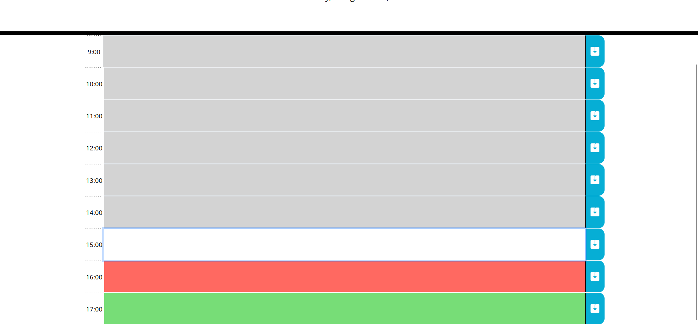
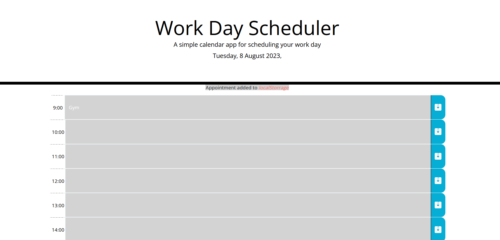

# Work Day Scheduler

## Description

Work Day Scheduler is a simple calendar app for scheduling your work day. It provides a user-friendly interface to input and manage appointments for different hours of the day. The app color-codes appointments to distinguish between past, present, and future events.

## Features

- Display the current day at the top of the page.
- Color-coded time blocks to indicate the past, present, and future appointments.
- Ability to add appointments for each hour and save them using the "Save" button.
- Notification for successful save actions.

## Technologies Used

- HTML: Structure of the web page.
- CSS: Styling and layout of the page.
- JavaScript: Handling dynamic behavior and interactions.
- Bootstrap: Front-end framework for responsive design.
- Font Awesome: Icons for buttons.
- Day.js: Library for date and time manipulation.
- jQuery: JavaScript library for DOM manipulation.

## Getting Started

1. Clone or download this repository to your local machine.
2. Open the `index.html` file in a web browser.

## Usage

1. Upon opening the app, you'll see the current day and time blocks representing each hour from 9 AM to 5 PM.
2. Time blocks are color-coded:

   - Gray: Past hours
   - Red: Current hour
   - Green: Future hours

     

3. Click an input field for a specific hour to add an appointment or task.

   

4. After entering the appointment, click the "Save" button next to the input field to save the appointment.
5. A notification will briefly appear if the save is successful.

   

6. Saved appointments persist even after refreshing the page.

## Contributing

Contributions are welcome! To report issues or contribute, please open an issue or submit a pull request on GitHub.

## License

This project is licensed under the MIT License. See the [LICENSE](LICENSE) file for more details.
